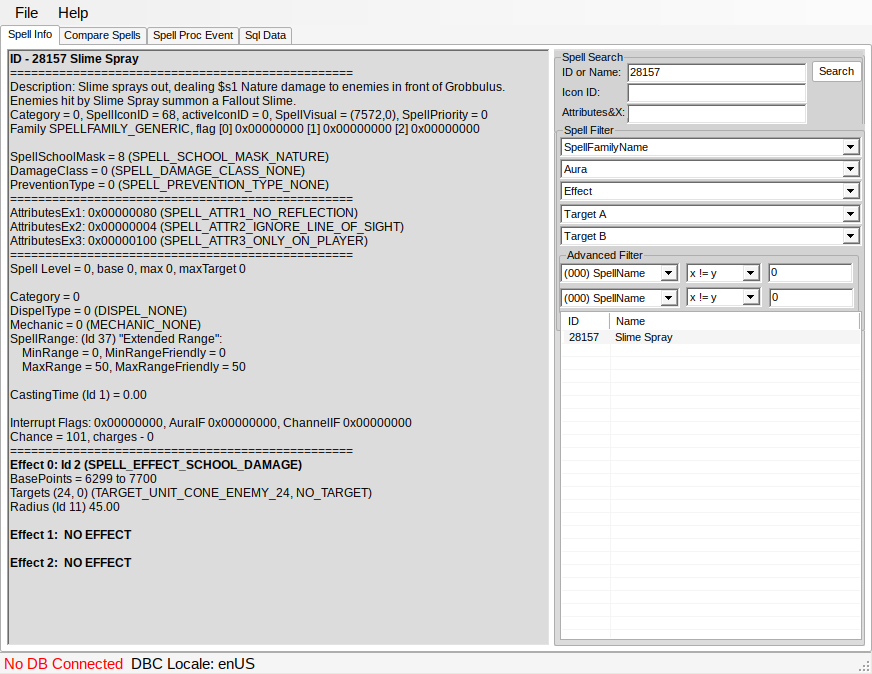
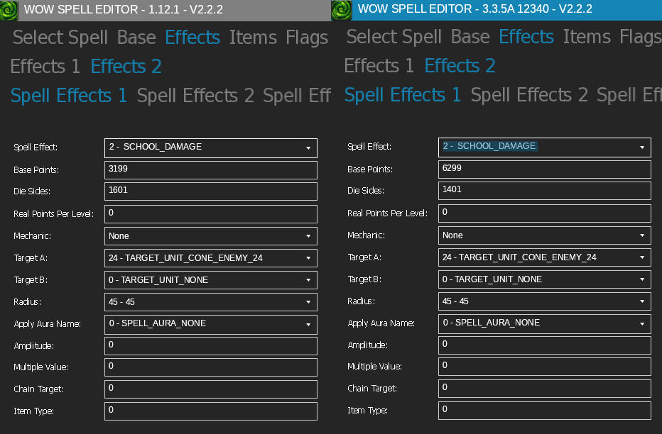
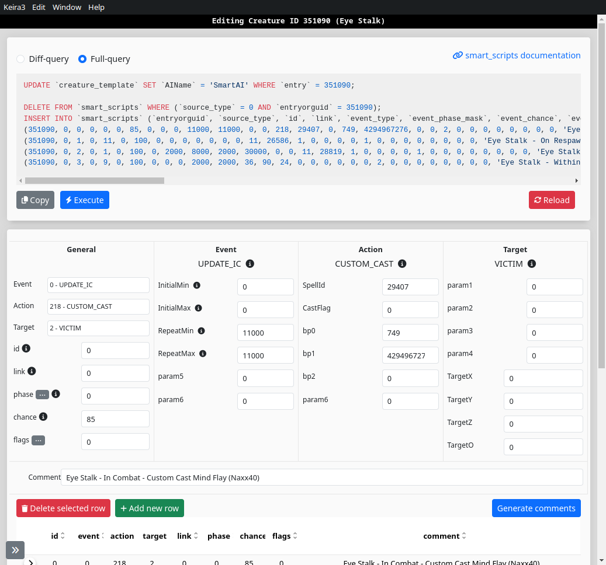
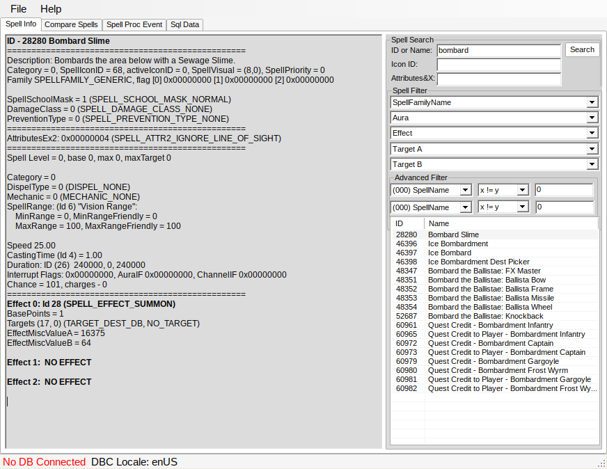

# Adjusting spells

Figure out the spellId by reading `*.cpp` script or smartAI

tools and how I use these for adjusting spells:
* [Spellworks](https://github.com/Kitzunu/SpellWork): browse 335 spells
* [SpellEditor](https://github.com/stoneharry/WoW-Spell-Editor): compare 112 335 effects, create custom spells
* [Keira3](https://github.com/azerothcore/Keira3): edit smartAI, creature template spells


## Custom Cast with cpp
For example Grobbulus' Poison Spray

```
    SPELL_SLIME_SPRAY                       = 28157,
```

Lookup spell `28157` in spellwork to get an idea of what it does



important: `Effect 0` and `SPELL_EFFECT_SCHOOL_DAMAGE`

Next we compare 335 with 112 to get an idea of the changes made to this spell



Since this spell is unchanged besides damage and the spell is cast from a `*.cpp` script, we can use `CustomCast` to change the Base Points of Effect0 (bp0) value

CustomCast allows to change bp0, bp1, bp2 and some other effects as defined in

`SpellDefines.h`
```
    SPELLVALUE_BASE_POINT0,
    SPELLVALUE_BASE_POINT1,
    SPELLVALUE_BASE_POINT2,
    SPELLVALUE_RADIUS_MOD,
    SPELLVALUE_MAX_TARGETS,
    SPELLVALUE_AURA_STACK,
    SPELLVALUE_AURA_DURATION,
    SPELLVALUE_FORCED_CRIT_RESULT
```

Casting with modified bp0 is not 100% accurate as we are not changing the die points, but it is accurate enough
```
int32 bp0 = 3200;
me->CastCustomSpell(me->GetVictim(), SPELL_SLIME_SPRAY, &bp0, 0, 0, false);
```

Example with more effect, changing the damage and max targets of chain lightning
```
CustomSpellValues values;
int32 customChainLightningDamage = 1850; // (1850, 2150), die 675
values.AddSpellMod(SPELLVALUE_BASE_POINT0, customChainLightningDamage);
values.AddSpellMod(SPELLVALUE_MAX_TARGETS, 15);
me->CastCustomSpell(SPELL_CHAIN_LIGHTNING, values, me->GetVictim(), TRIGGERED_NONE, nullptr, nullptr, ObjectGuid::Empty);

```
## Custom Cast with smartAI

SmartAI also has a custom cast options to modify these values.

For example Eye Stalk reduces damage from 2.5k to 750 and movement speed -50% to only -20%
```
-- Eye Stalk
-- Reduce damage 2.5k to 750, movement speed reduction -50 to -20 (as unsigned int)
```

Change bp0 which changes damage,
and bp1 changes movement speed reduction. However! negative int32 needs to be written as unsigned int. So `4294967276` actually means -20

Try -20 https://www.simonv.fr/TypesConvert/?integers




## Spell Script
For more advanced changes we must use a spell script.

Razuvious' Shout in 335 is physical damage that has 60+ yard range, ignores line of sight. However in vanilla this shout is max 45 yards, does not ignore line of sight and burns mana + deals damage

Attach spell_script to spellId
```
-- 55543: 10 man version of Disrupting Shout
DELETE FROM `spell_script_names` WHERE `spell_id` = 55543;
INSERT INTO `spell_script_names` (`spell_id`, `ScriptName`)
VALUES(55543, 'spell_razuvious_disrupting_shout');
```

With a guard clause to not touch Naxx10/25 and only new Naxx10 HC (naxx40)
```
class spell_razuvious_disrupting_shout_40 : public SpellScriptLoader
{
public:
    spell_razuvious_disrupting_shout_40() : SpellScriptLoader("spell_razuvious_disrupting_shout") { }

    class spell_razuvious_disrupting_shout_40_SpellScript : public SpellScript
    {
        PrepareSpellScript(spell_razuvious_disrupting_shout_40_SpellScript);

        void PreventLaunchHit(SpellEffIndex effIndex)
        {
            Unit* caster = GetCaster();
            if (!caster || (caster->GetMap()->GetDifficulty() != RAID_DIFFICULTY_10MAN_HEROIC))
            {
                return;
            }
            if (Unit* target = GetHitUnit())
            {
                // ignore los -> not ignore los
                // radius 60yd -> 45yd
                PreventHitDefaultEffect(effIndex);
                if (!target->IsWithinLOSInMap(caster) || !target->IsWithinDist2d(caster, 45.0f))
                {
                    SetEffectValue(0);
                    return;
                }
                Powers PowerType = POWER_MANA;
                // int32 amountToDrain = urand(4050,4950);
                int32 amountToDrain = urand(500,501);
                int32 drainedAmount = -target->ModifyPower(PowerType, -amountToDrain);
                SetEffectValue(drainedAmount);
            }
        }

        void Register() override
        {
            OnEffectHitTarget += SpellEffectFn(spell_razuvious_disrupting_shout_40_SpellScript::PreventLaunchHit, EFFECT_0, SPELL_EFFECT_SCHOOL_DAMAGE);
        }
    };

    SpellScript* GetSpellScript() const override
    {
        return new spell_razuvious_disrupting_shout_40_SpellScript();
    }
};
```

## Custom spells
Some effects can only be achieved by a custom spell.

Note that custom spells do not exist on client side without a patch, so anything with a visual will simply not show up. Server-side spells are OK but should be minimized

For example we must use a custom spell for edit summon spell entries. Where the ID of the summoned creature is `EffectMiscValueA`

For example Bombard Slime (Grobbulus) summons `16375`. We must change this to a level 60 creature instead.



Copy paste and edit the entry `16375` to our new creature ID `351071`

```
DELETE FROM `spell_dbc` WHERE (`ID` = 90003);
INSERT INTO `spell_dbc` (...) VALUES
(90003,0,...351071,...,"Bombard Slime",...);
```

and then change spell cast by Grobbulus to our new spell
```
SPELL_BOMBARD_SLIME = 90003 // update summon entry
```
