# Pictures

## Quests
Attunement
kill quest Echoes of War
T3 quests
Frost Resistance
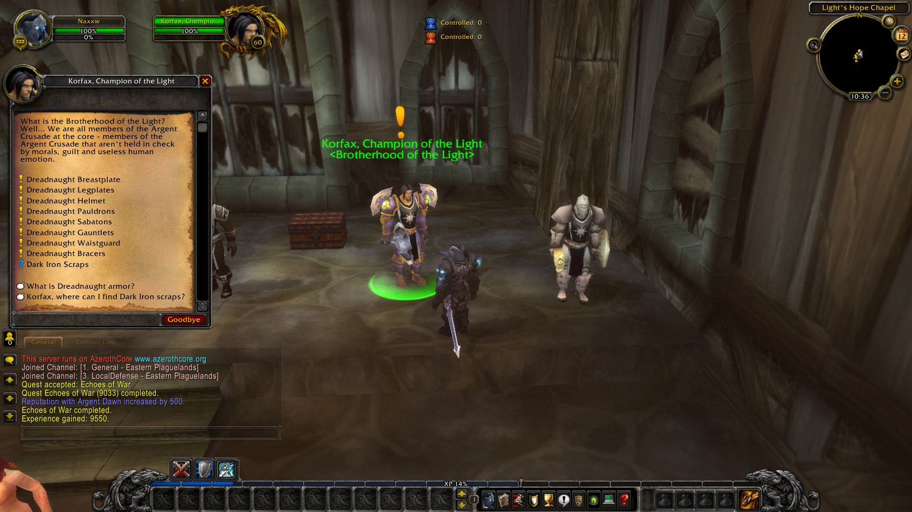

## Frost Resistance
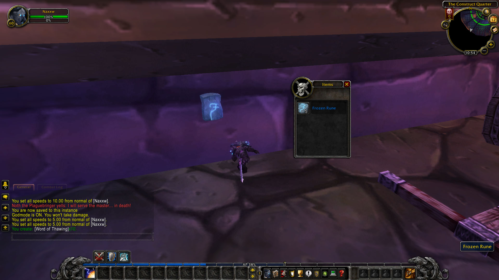

Omarion teaches crafting recipes. With conditions, must be atleast revered/exalted and have high enough skill

Anvil requirement to some stuff

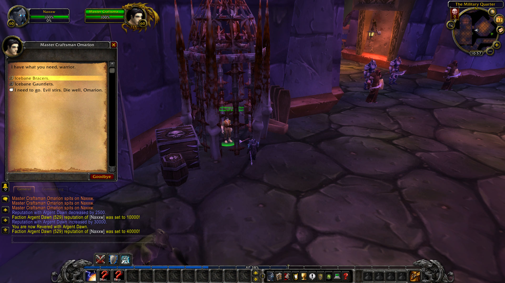

## Loot
Boss + Trash loot
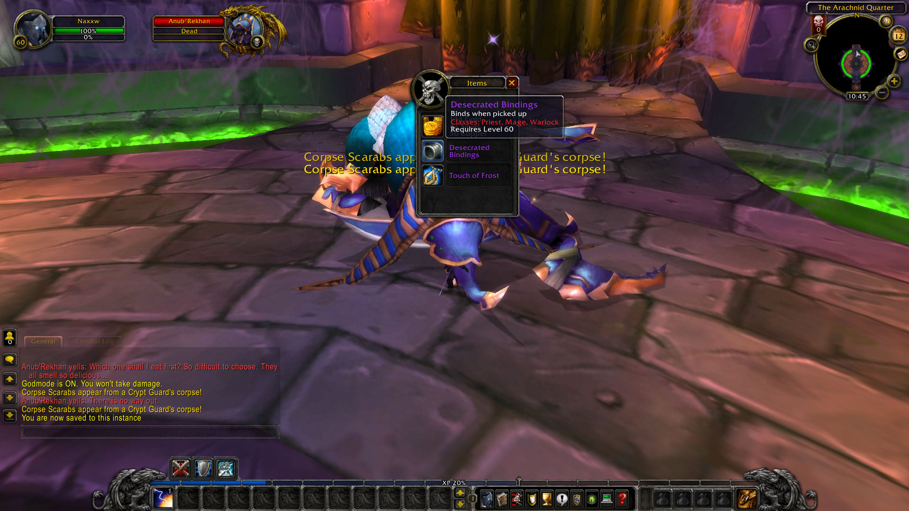

## Trash NPCs
old trash mobs

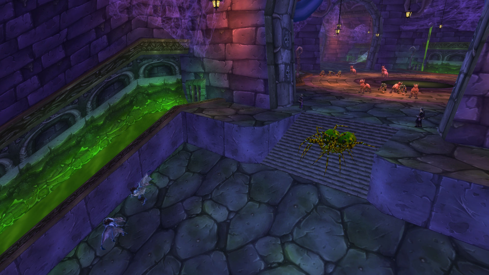

## Tarsis
RP, scripted Atiesh RP
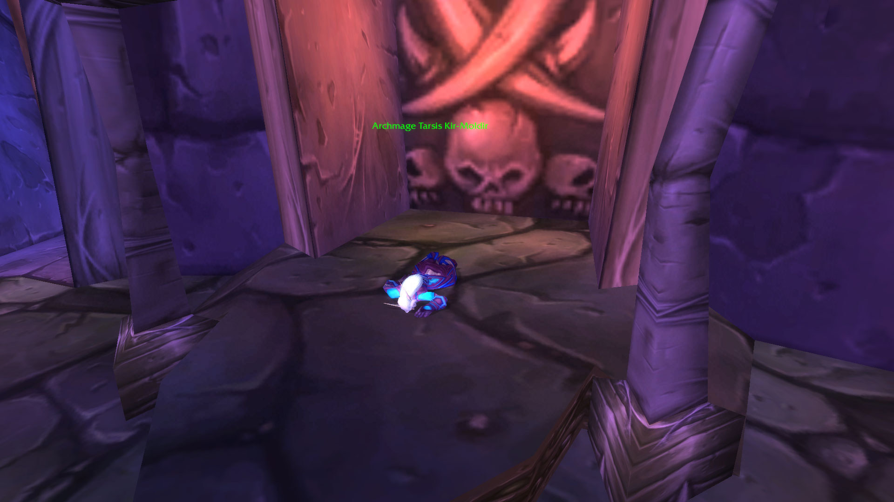

## Plaguewood
floating naxx, meeting stone, teleport object inside ziggurath
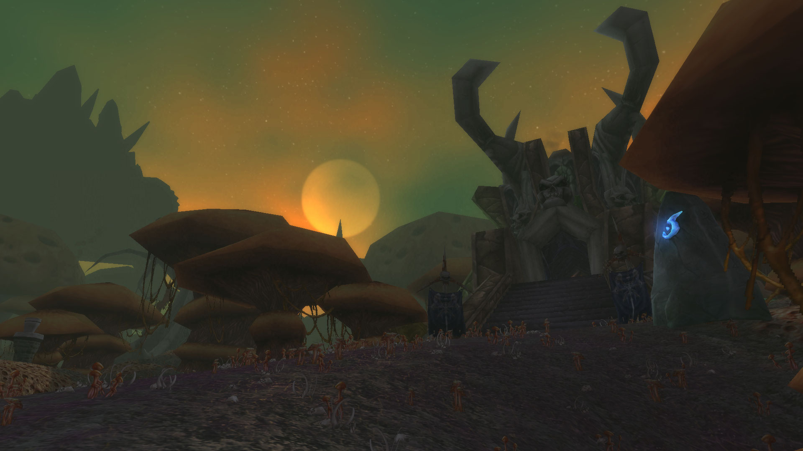
with custom patch the original teleporter can be brought back in

teleporter inside ziggurath
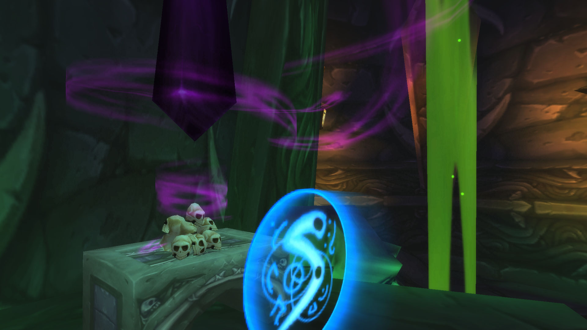

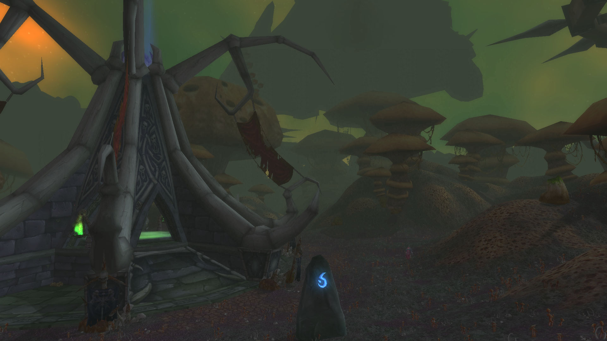

## Stratholme entrance
beta entrance, gate opens if attuned
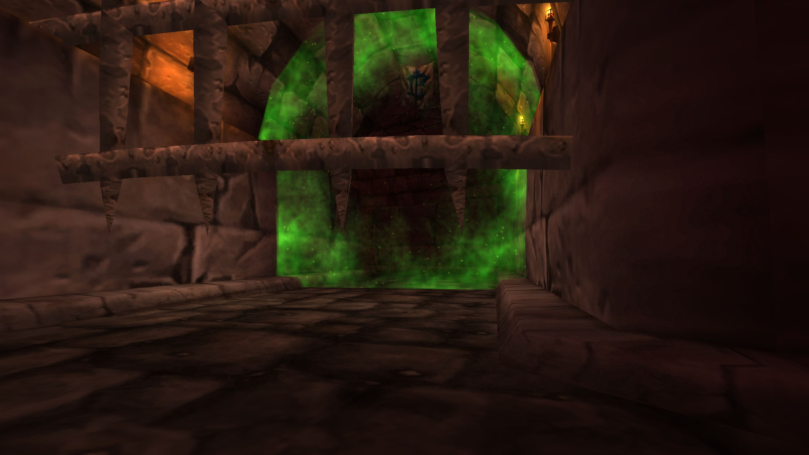

## Boss mechanics
some vanilla boss mechanics.

Heigan: tp room
Razu: 4 horsemen
Horsemen: Mograine, movable, spirits that continue to cast mark

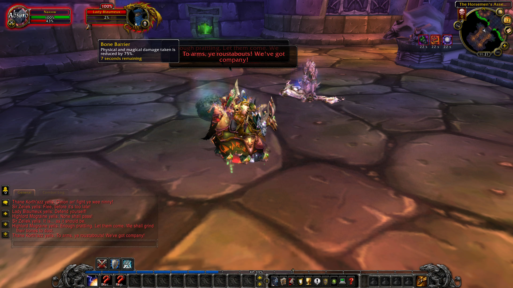
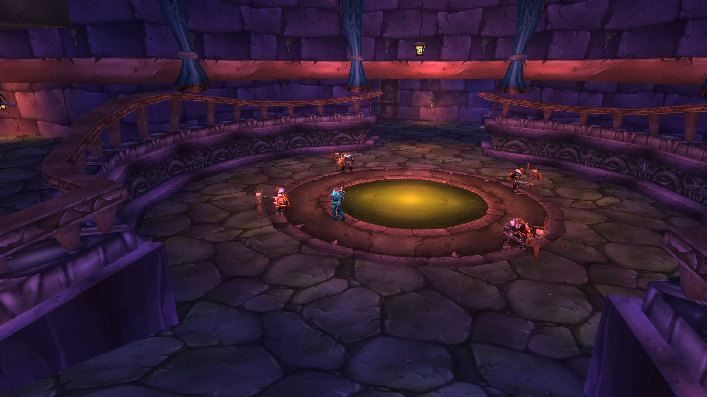
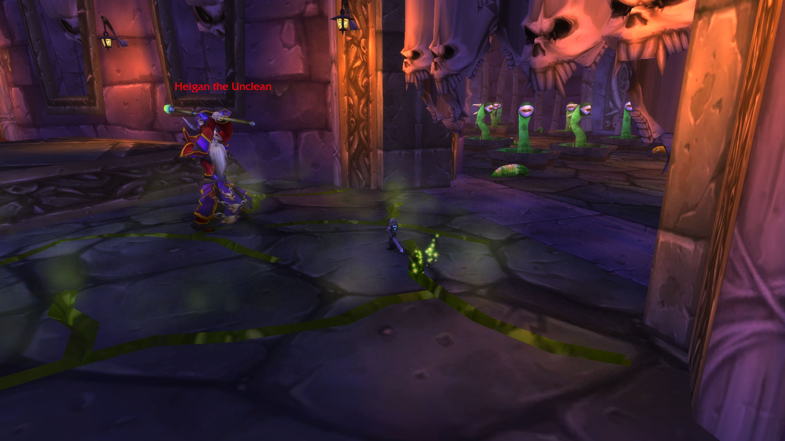
